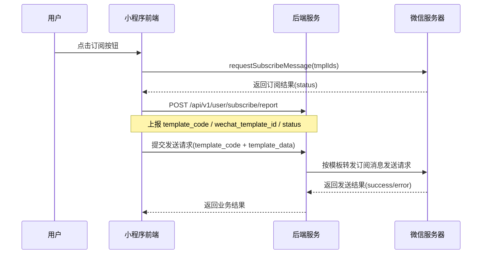

# 微信小程序订阅通知实现说明

只讲实现流程和必要配置。

## 1. 基础配置

- 前端需要配置小程序 `appid`：`VITE_WECHAT_APP_ID`
- 后端需要同时配置：`appid` + `appsecret`

没有后端 `appsecret`，无法完成微信订阅消息发送。

## 2. 实现流程



### 步骤 A：前端拉起订阅授权

前端调用 `uni.requestSubscribeMessage`（微信原生是 `wx.requestSubscribeMessage`），让用户在微信弹窗中选择是否接受订阅。

用户选择结果由微信返回给前端（如 `accept` / `reject` / `ban` / `filter`）。

### 步骤 B：前端上报订阅结果

前端把用户选择结果上报后端：

- `POST /api/v1/user/subscribe/report`
- 参数：`template_code`、`wechat_template_id`、`status`

这一步只记录用户授权状态，不负责发送消息。

### 步骤 C：前端提交模板字段给后端

当业务需要发送订阅通知时，前端提交：

- `template_code`
- `template_data`

`template_data` 的字段名必须和微信模板字段完全一致。

例如模板字段是：

- `thing1`
- `time2`
- `character_string3`
- `thing4`

则前端应传：

```json
{
  "thing1": { "value": "登录类型" },
  "time2": { "value": "2026-04-03 12:30" },
  "character_string3": { "value": "127.0.0.1" },
  "thing4": { "value": "张三(2024201514)" }
}
```

### 步骤 D：后端转发到微信发送

后端根据 `template_code` 找到对应 `wechat_template_id`，再把 `template_data` 转发给微信服务器。

发送动作由后端执行。

## 3. 最常见问题

- 报错 `47003 argument invalid`：通常是模板字段缺失或某个 `value` 为空（比如 `time2.value is empty`）
- 根因：前端提交字段与模板不匹配，或内容为空
- 处理：按模板字段逐个检查，确保字段名和内容都正确
